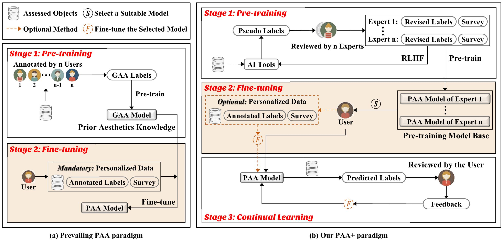

[](https://opensource.org/licenses/Apache-2.0)
[](https://pytorch.org/)

<div align="center">
<h1>
<b>
Rethinking Personalized Aesthetics Assessment: Employing Physique Aesthetics Assessment as An Exemplification
</b>
</h1>
<h4>
<b>
Haobin Zhong, Shuai He, Anlong Ming, Huadong Ma
    
Beijing University of Posts and Telecommunications
</b>
</h4>
</div>

-----------------------------------------


[[国内的小伙伴可以看这]](https://github.com/woshidandan/Rethinking-Personalized-Aesthetics-Assessment/blob/main/README_CN.md)
This repo contains the official implementation and the new dataset PhysiqueAA50K of the **CVPR 2025** paper.

## Introduction
The Personalized Aesthetics Assessment (PAA) aims to accurately predict an individual's unique perception of aesthetics. With the surging demand for customization, PAA enables applications to generate personalized outcomes by aligning with individual aesthetic preferences.
The prevailing PAA paradigm involves two stages: pre-training and fine-tuning, but it faces three inherent challenges: 

1) The model is pre-trained using datasets of the Generic Aesthetics Assessment (GAA), but the collective preferences of GAA lead to conflicts in individualized aesthetic predictions.
2) The scope and stage of personalized surveys are related to both the user and the assessed object; however, the prevailing personalized surveys fail to adequately address assessed objects' characteristics.
3) During application usage, the cumulative multimodal feedback from an individual holds great value that should be considered for improving the PAA model but unfortunately attracts insufficient attention.

To address the aforementioned challenges, we introduce a new PAA paradigm called PAA+, which is structured into three distinct stages: pre-training, fine-tuning, and continual learning. 
Furthermore, to better reflect individual differences, we employ a familiar and intuitive application, physique aesthetics assessment (PhysiqueAA), to validate the PAA+ paradigm.  We propose a dataset called PhysiqueAA50K, consisting of over 50,000 annotated physique images. Furthermore, we develop a PhysiqueAA framework (PhysiqueFrame) and conduct a large-scale benchmark, achieving state-of-the-art (SOTA) performance. Our research is expected to provide an innovative roadmap and application for the PAA community. 



## Code Usage Instructions

* ### **Training Objective**
The goal is to predict the PhysiqueAA Scores: appearance, health, and posture.

* ### **Installation**
```
conda create -n physiqueAA python=3.10.14
conda activate physiqueAA
pip install -r requirements.txt
cd ./code
bash script.sh
```
download SMPLer_X checkpoints from [Baidu Netdisk](https://pan.baidu.com/s/1vno-V5VoozFhLxrfkjLHqg?pwd=jx37) to `./code/SMPLer_X/pretrained_models`

download smplx.npz from [Baidu Netdisk](https://pan.baidu.com/s/1GMX6j_B4l36Zfg90u_QRug?pwd=267p) to `.code/SMPLer_X/common/utils_smpler_x/human_model_files/smplx`

download Swinv2 checkpoints from [Baidu Netdisk](https://pan.baidu.com/s/10KRxE95g9WnoitJ-hoO38A?pwd=6zd5) to `./code/models_/pam/pretrained`

All resources can also download from [OneDrive](https://bupteducn-my.sharepoint.com/:f:/g/personal/hs19951021_bupt_edu_cn/EugRql7EAD1Fr6cfo0_0X-QBPILI1QAAPYzPvxKc8GlbkQ?e=TG3C0x)

If you encounter the following error message:
```
RuntimeError: Subtraction, the `-` operator, with a bool tensor is not supported. If you are trying to invert a mask, use the `~` or `logical_not()` operator instead.
```
The Solution: Modify `1- mask` to `~mask` in torchgeometry/core/conversions.py

Example: Modify mask_c2 = `(1 - mask_d2) * mask_d0_nd1` to `mask_c2 = (~mask_d2) * mask_d0_nd1`

* ### **Training Steps**
1. Download the dataset from [Baidu Netdisk](https://pan.baidu.com/s/1NgBbu6Jf4IxrynigqO028g?pwd=kvev).
2. Use `train.py` to train the network.

* ### **Inference**
1. Use `inference.py` to train the network.

* ### **PhysiqueFrame Checkpoint Files**
1. Download the PhysiqueFrame checkpoint files from [Baidu Netdisk](https://pan.baidu.com/s/1OOt2X30qe93HmW8XJbPbaQ?pwd=n124).

Unfortunately, PENet cannot be open-sourced due to its enterprise use. However, we have included the preference feature (preference tensor) generated by PENet in the dataset.


## If you find our work is useful, please cite our paper:
```

```
